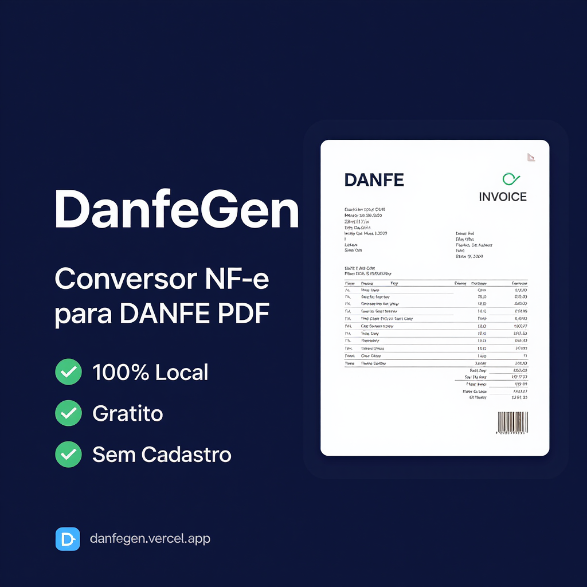

# DanfeGen — Conversor NF-e para DANFE PDF



Converta XML de NF-e em **DANFE PDF A4** e **Etiqueta Térmica 80mm** direto no navegador.
100% local, sem cadastro, sem envio de dados.

[](https://danfegen.vercel.app)
[](LICENSE)
[](https://www.typescriptlang.org)
[](https://react.dev)

---

## ✨ Funcionalidades

- 📄 **DANFE A4** — layout oficial SEFAZ com todos os campos obrigatórios
- 🖨️ **Etiqueta Térmica 80mm** — otimizada para impressoras térmicas
- 📦 **Processamento em lote** — múltiplos XMLs de uma vez, exporta ZIP
- 🔒 **100% local** — nenhum XML é enviado para servidores
- 🌙 **Dark mode** — tema claro e escuro automático
- ⚙️ **Configurações da empresa** — logo, dados e integração ERP
- 📱 **Responsivo** — funciona em desktop e mobile

---

## 🚀 Demo

**[danfegen.vercel.app](https://danfegen.vercel.app)**

---

## 🛠️ Tecnologias

| Camada | Tecnologia |
|---|---|
| Framework | React 19 + TypeScript 5.9 |
| Build | Vite 6 + SWC |
| Estilo | Tailwind CSS 3 |
| PDF | @react-pdf/renderer 4 |
| Validação | Zod 4 |
| Deploy | Vercel (Edge + Functions) |

---

## 📁 Estrutura do Projeto

```
danfe-gen/
├── api/                     # Vercel Functions (Node.js)
│   ├── generate-pdf.ts      # Gera PDF/ZIP server-side
│   └── parse-xml.ts         # Parseia XML NF-e
├── public/                  # Assets estáticos
│   ├── fonts/               # Inter Variable (woff2 + ttf)
│   ├── og-preview.png       # Preview Open Graph
│   └── manifest.webmanifest # PWA manifest
├── src/
│   ├── components/
│   │   ├── Danfe/           # DanfeA4, DanfeThermal
│   │   ├── Layout/          # AppHeader, AppFooter
│   │   ├── Preview/         # DanfePreview, DanfeFields
│   │   ├── Settings/        # CompanyConfig, ErpConnect
│   │   ├── UI/              # Alert, Badge, Button, Toast...
│   │   └── Upload/          # UploadZone, BatchProgress
│   ├── contexts/            # Company, NFe, Theme
│   ├── hooks/               # usePdfGenerator, useXmlParser...
│   ├── schemas/             # Zod schemas (nfe, company)
│   ├── types/               # TypeScript types
│   └── utils/               # formatters, validators, parsers
├── middleware.ts            # Vercel Edge Middleware (auth + rate limit)
└── vercel.json              # Configuração de deploy
```

---

## 💻 Rodando Localmente

### Pré-requisitos

- Node.js >= 20
- npm >= 10

### Instalação

```bash
# Clone o repositório
git clone https://github.com/alberto2santos/danfe-gen.git
cd danfe-gen

# Instale as dependências
npm install
```

### Variáveis de Ambiente

Crie um arquivo `.env` na raiz:

```env
DANFEGEN_API_KEY=sua-chave-master-aqui
DANFEGEN_DEMO_KEY=demo-public-key-2024
```

### Iniciando

```bash
npm run dev
```

Acesse [http://localhost:5173](http://localhost:5173)

---

## 📦 Scripts Disponíveis

```bash
npm run dev          # Servidor de desenvolvimento
npm run build        # Build de produção
npm run preview      # Preview do build local
npm run analyze      # Bundle analyzer
npm run lint         # ESLint (zero warnings)
npm run type-check   # TypeScript sem emitir arquivos
npm run audit        # Auditoria de segurança npm
```

---

## 🖨️ Configurando Impressora Térmica

No diálogo de impressão do navegador:

1. **Margens** → Nenhuma
2. **Cabeçalhos e Rodapés** → Desmarcar
3. **Escala** → 100%
4. **Tamanho do papel** → 80mm × Comprimento automático

---

## 🔌 API (Vercel Functions)

### `POST /api/generate-pdf`

Gera PDF de uma NF-e ou lote de NF-es.

```json
// Single
{
  "mode": "single",
  "nfeData": { ... },
  "config": { ... }
}

// Batch (máx. 5 NF-es)
{
  "mode": "batch",
  "items": [
    { "nfeData": { ... } },
    { "nfeData": { ... } }
  ]
}
```

**Headers obrigatórios:**
```
x-danfegen-key: sua-chave-api
```

### `POST /api/parse-xml`

Parseia e valida um XML NF-e.

---

## 🔒 Segurança

- XMLs processados **100% no navegador** — nunca trafegam pela rede
- API protegida por `x-danfegen-key` via Edge Middleware
- Rate limiting: 5 req/min (demo) · 10 req/min (master)
- CORS restrito ao domínio de produção

---

## 📄 Licença

MIT © 2026 [Alberto Luiz](https://github.com/alberto2santos)
